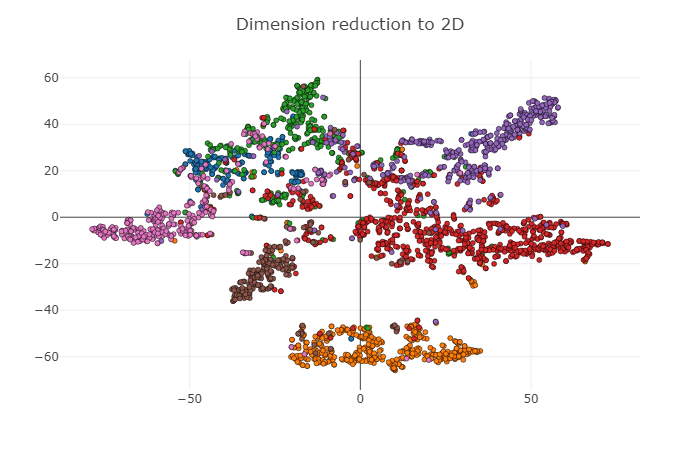

Modification of Graph Convolutional Networks in PyTorch
====

## introduction

**Modification of [Graph Convolutional Networks in PyTorch](https://github.com/tkipf/pygcn), visualization of test set results was added in this version with t-SNE algorithm.**

You can cancel the visualization of ground truth and test set results with `--no_visual` for quick debugging.

Thanks to the original author [Thomas Kipf](https://github.com/tkipf)  for the open source code, which provided me with the opportunity to learn.

The visualization results are shown below:




In addition, the division of the training set in this project is not the same as the division method in the paper. In the paper, 4 samples are selected from each type of sample to form the training set, while 100 samples are randomly selected as the training set in the project.

PyTorch implementation of Graph Convolutional Networks (GCNs) for semi-supervised classification [1].

For a high-level introduction to GCNs, see: Thomas Kipf, [Graph Convolutional Networks](http://tkipf.github.io/graph-convolutional-networks/) (2016)


Note: There are subtle differences between the TensorFlow implementation in https://github.com/tkipf/gcn and this PyTorch re-implementation. This re-implementation serves as a proof of concept and is not intended for reproduction of the results reported in [1].

This implementation makes use of the Cora dataset from [2].

## Installation

```python setup.py install```

## Requirements

  * PyTorch 0.4 or 0.5
  * Python 2.7 or 3.6

## Usage

```python train.py```

The following optional hyperparameters can be set before running：

- no_cuda：Disables CUDA training.
- fastmode：Validate during training pass.
- seed：Random seed.
- epochs：Number of epochs to train.
- lr：Initial learning rate.
- weight_decay：Weight decay (L2 loss on parameters).
- hidden：Number of hidden units.
- dropout：Dropout rate (1 - keep probability).

## References

[1] [Kipf & Welling, Semi-Supervised Classification with Graph Convolutional Networks, 2016](https://arxiv.org/abs/1609.02907)

[2][Sen et al., Collective Classification in Network Data, AI Magazine 2008](http://linqs.cs.umd.edu/projects/projects/lbc/)


